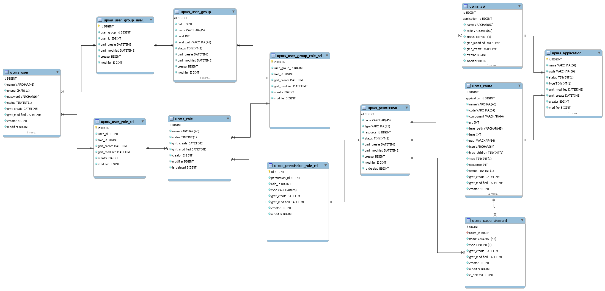

# 介绍
KT-UPMS 通用用户权限管理系统

# 作用
基于RBAC（Role-Based Access Control ）模型下沉的通用权限体系系统，可满足98%的Web应用系统。
整体围绕着用户、角色、权限三个实体进行实现。控制粒度达到页面按钮级。

# 目录结构

```
├── asserts         // 项目资源（sql等）
├── kt-upms-api     // 负责系统内部api
├── kt-upms-dao     // 数据访问层，负责和db做数据交互
├── kt-upms-manager // 第三方服务聚合层，统一封装集成第三方服务的调用，比如微信、百度等
├── kt-upms-openapi // 对外部系统提供能力
├── kt-upms-rpc     // rpc封装（Thrift，Feign、ProtoBuf等） 
├── kt-upms-service // 业务聚合层
├── kt-upms-start   // 程序入口
└── pom.xml

```

# 功能
- 用户管理
	- [x] 添加用户
	- [x] 编辑用户
	- [x] 查询用户列表
	- [x] 查看用户详情
	- [x] 禁用用户
	- [x] 启用用户

- 用户组管理
	- [ ] 添加用户组
	- [ ] 删除用户组
	- [ ] 编辑用户组
	- [ ] 查看用户组
	- [ ] 用户组用户管理
	- [ ] 用户组角色分配
  
- 角色管理
	- [ ] 添加角色
	- [ ] 删除角色
	- [ ] 编辑角色
	- [ ] 查看角色
	- [ ] 角色权限分配

- 权限管理
	- [ ] 添加权限
	- [ ] 删除权限
	- [ ] 编辑权限
	- [ ] 查看权限
	- [ ] 资源分配（菜单、页面元素）

- 菜单管理
	- [ ] 添加菜单
	- [ ] 删除菜单
	- [ ] 编辑菜单
	- [ ] 查看菜单
- 页面管理
	- [ ] 添加页面
	- [ ] 删除页面
	- [ ] 编辑页面 
	- [ ] 查看页面
	- [ ] 页面元素管理
	
# 数据模型

## ER图


## 表说明

| 表名  | 说明 |
| ----- | ---- |
| upms_user_group | 用户组表 |
| upms_user_group_user_rel | 用户组与用户关联表 |
| upms_user_group_role_rel | 用户组与角色关联表 |
| upms_user | 用户表 |
| upms_role | 角色表 |
| upms_user_role_rel | 用户角色关联表 |
| upms_permission | 权限表 |
| upms_permission_resource_rel | 权限与资源关联表 |
| upms_permission_role_rel | 角色与权限关联表 |
| upms_menu | 用户表 |
| upms_page | 页面表 |
| upms_page_element | 页面元素表 |
| upms_api | api表 |

