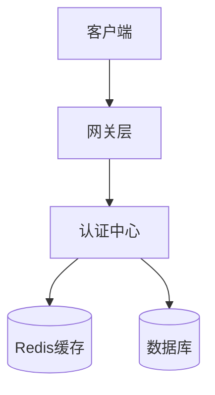
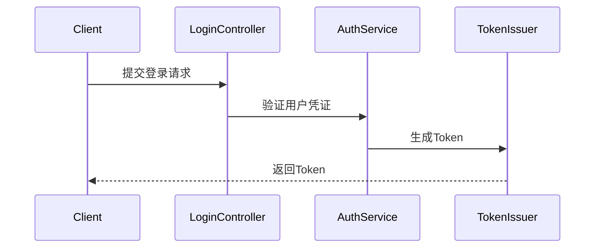

# Ark认证中心文档

## 1. 系统概述

### 1.1 项目简介
Ark认证中心(ark-center-auth)是一个统一的认证和授权服务，为整个Ark微服务架构提供集中式的身份验证和访问控制能力。主要解决企业应用中的用户认证、API访问控制等核心问题。

### 1.2 核心能力
- [x] 登录认证模块
  - 用户名密码认证
  - Token签发与验证
  - 会话管理
- [x] 验证码模块
  - 图形验证码
  - 短信验证码
  - 邮箱验证码

### 1.3 技术架构

#### 1.3.1 系统架构图


#### 1.3.2 技术栈清单
- 开发语言：Java
- 框架：Spring Boot
- 数据存储：MySQL + Redis

## 2. 系统功能

### 2.1 核心模块
- **用户(User)**: 系统的登录主体
- **认证令牌(Token)**: 用户登录后的身份凭证

### 2.2 模块关系


## 3. 核心流程

### 3.1 认证流程

#### 3.1.1 登录认证流程


## 4. 接口文档

### 4.1 认证接口
- POST /api/v1/auth/login - 用户登录
- POST /api/v1/auth/logout - 用户登出
- GET /api/v1/auth/token/verify - Token验证

## 5. 部署运维

### 5.1 环境要求
- JDK 17+
- MySQL 8.0+
- Redis 6.0+

### 5.2 配置说明
关键配置项：
```yaml
ark:
  auth:
    token:
      expire-time: 7200  # Token过期时间(秒)
    cache:
      redis:
        prefix: "ark:auth:"  # 缓存前缀
```

## 6. 开发指南

### 6.1 代码结构
```
ark-center-auth/
├── controller    # 控制器层
├── service      # 业务逻辑层
├── dao          # 数据访问层
└── common       # 公共组件
```

### 6.2 开发规范
1. 遵循三层架构
2. 统一异常处理
3. 缓存设计遵循二级缓存模式

## 7. 常见问题

### 7.1 故障排查
1. Token验证失败
   - 检查Token是否过期
   - 验证Token格式是否正确
   - 确认Redis缓存是否正常 